# Subtitler

Use the power of Whisper to transcribe any video clip and generate it's subtitles (srt) file. Also, use cutting-edge AI-power translation-services to translate the generated subtitles to any language you want.

## What ?

Subtitler is a utility that can be used as GUI or CLI depending on your preference.
It uses open-AI's Whisper model to generate a transcript of a video. It additionally can also translate the generated transcript to other languages.
All the transcriptions and translations are stored as `.srt` files.

The most common usecase for using this utility is to auto-generate subtitles for your TVShows, Movies, Home-Videos or auto-generate lyrics for your Music. And not only just auto-generate subtitles and lyrics, but auto-convert them to the language of your preference.

This is most useful when used in conjunction with a Media-Library/Server like Kodi, Emby, Plex or Jellyfin wherein you may have a private library of multimedia and want to enrich it by generating subtitles.

This is a decent alternative to open-subtitles where, subtitles are crowdsourced and can be used to suppliment subtitles not found on such sites.

## Why ?

Simply put, when I looked at whisper's [show-and-tell](https://github.com/ggerganov/whisper.cpp/discussions/categories/show-and-tell) section on github, I did not find a promising utility that could robustly do what I wanted, i.e generate subtitles for all my media files in my jellyfin library in multiple languages.

## How ?

### How do I install this utility ?

The easiest way is

```
pip install git+https://github.com/anupamkumar/subtitler.git
```

You could also clone or download the zip from github and install the following dependencies

```
    "ffmpeg-python",
    "openai-whisper",
    "Gooey@git+https://github.com/anupamkumar/Gooey.git@main",
    "deep-translator"
```

### How do I run this utility ?

##### Method 1

If you used `pip` to install, then you should have `subtitler` command available in the terminal of your choice.

* To start the GUI, type the following in your terminal

```
subtitler
```

* To run CLI version, type the following in your terminal

```
subtitler cli --help
```

##### Method 2

If you downloaded the zip or clone the repo. You can run the utility after installing the dependencies.

To run the GUI, type the following in the terminal

```
python subtitler.py
```

To run the CLI, type the following in the terminal

```
python subtitler.py cli
```

# Usage Guide

### Using the GUI

The GUI is useful for anyone who does not want to worry about command-line arguments, command line options.

The GUI looks like this
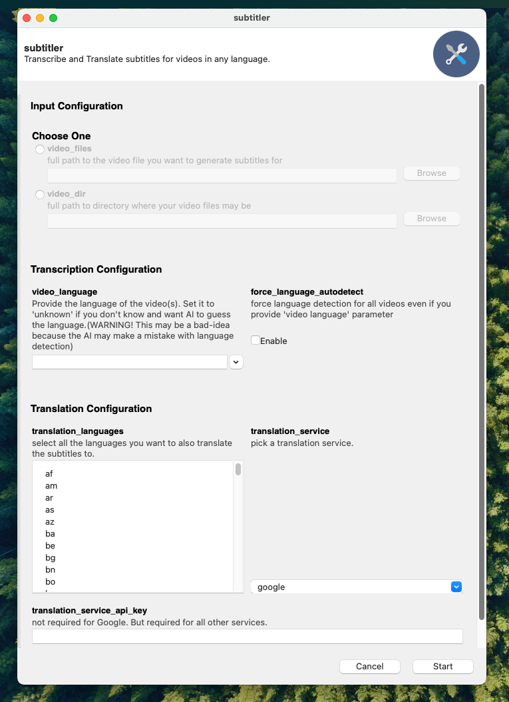

First, you'll need to give the utility, either bunch of files (each file is seperated by a `:` )
| screenshot | screenshot |
|------ | ------ |
| 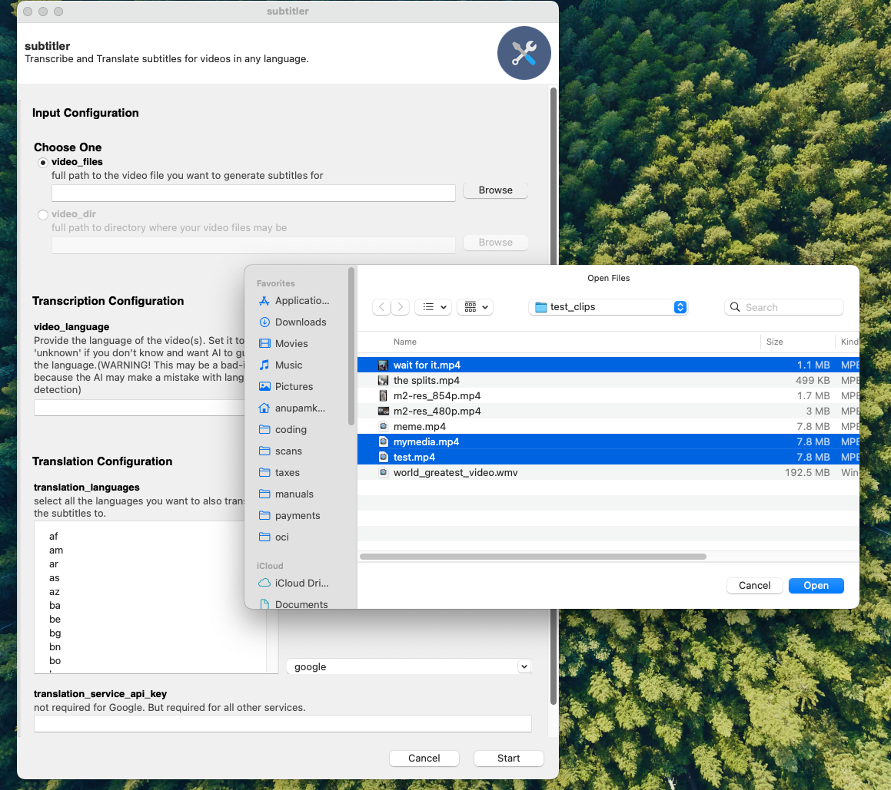 |  |

or You can give the utility a directory.
| screenshot | screenshot |
|------ | ------ |
| 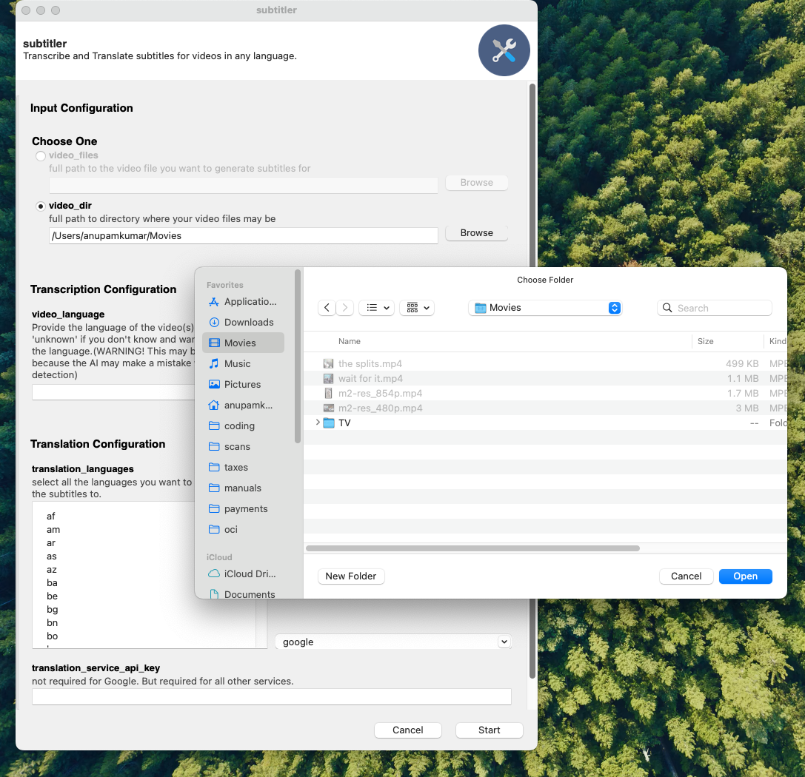 |  |

Next, you'll need to tell the utility what language your media is in. This will tell whisper what language to use to transcribe the media in.
| screenshot | screenshot |
|------ | ------ |
| 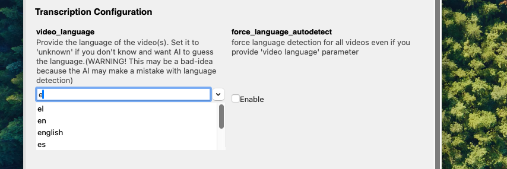 | 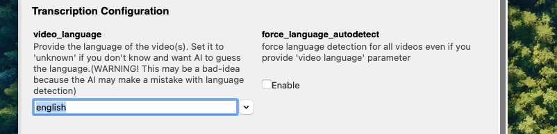 |

The language selection has auto-complete feature to make life easier...

> [!WARNING]
> You can try to force-autodetect language but this is not reliable, in my tests, and the Whisper model makes a lot of mistakes when it's asked to detect-language... Your milage may wary though.

Next, you'll give the utility all the languages you want to translate the transcript to. Make a selection from the box. You can select as many languages as you want.

Then, you'll select the translation service you'd like to use to do the translation.
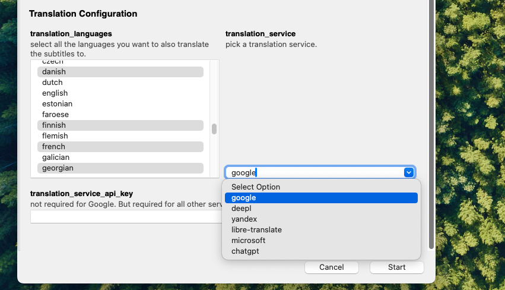

I was able to verify the following services work ... Not all services require API-key, but most of them do. AFAIK, only Google offer's translation services without needing authentication.

The table below gives more details.

| translation-service | description | requires api-key |
| ----- | ----- | ----- |
| google | [google translate's API](https://cloud.google.com/translate/docs/reference/rest) | no |
| deepl | [deepl's translation API](https://www.deepl.com/en/translator) | yes |
| yandex | [yandex translate API](https://yandex.cloud/en/docs/translate) | yes |
| libre-translate | [libre translate's API](https://libretranslate.com/) | yes |
| microsoft | [microsoft azure conginitive services translation API](https://learn.microsoft.com/en-us/azure/ai-services/translator/reference/v3-0-translate) | yes |
| chatgpt | [translation using openAI's chatgpt-API](https://platform.openai.com/api-keys) | yes |

> [!IMPORTANT]
> Be aware that all the translation services have character limits for their free-tier.

> [!NOTE]
> Explaining how to create API-keys for these translation services is beyond the scope of this document.

If you decide to translate using a service that uses API-key, enter the API-key in the API-key text box
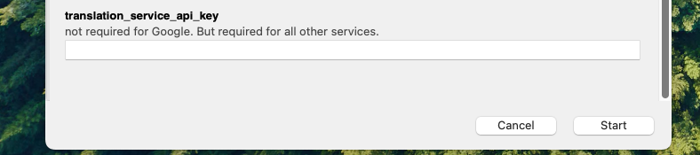

Finally, click the `start` button.

That should start the transcription and translation process.
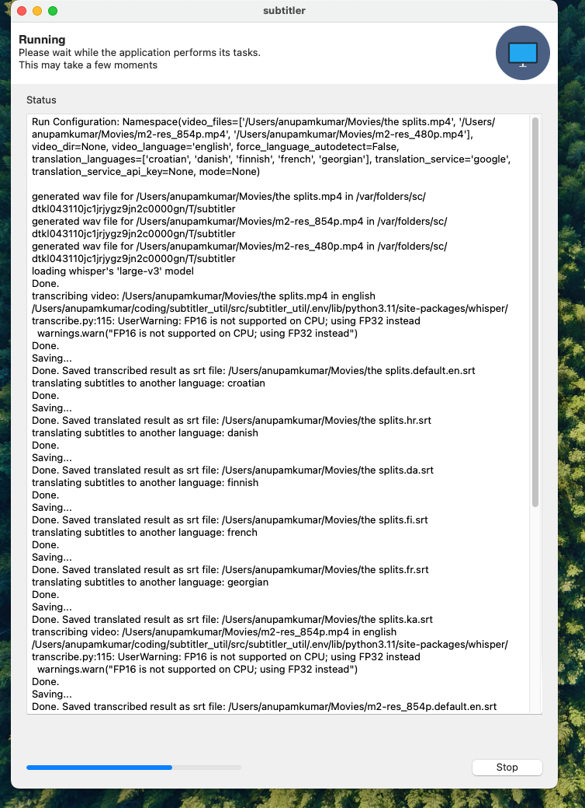

There is a lot of information thrown at you ... let's break it down.
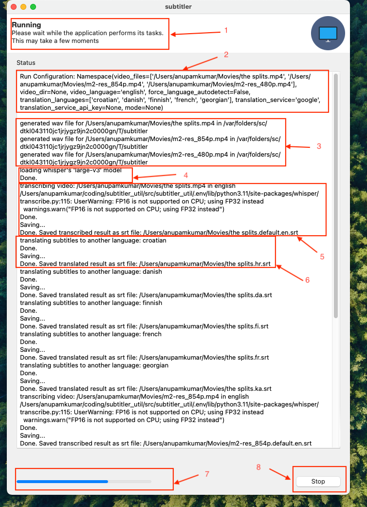

1. Shows the overall status of the job
2. Shows the current `run configuration` i.e the settings you chose, which includes the files/directories, transcription and translation config etc...
3. Shows the generation of temp files (and where they're stored. Don't worry, they automatically get cleaned up at the end of the job.)
4. Shows which model the job selected for transcription. The utility chooses the largest model that can run on your computer by default. This is done for the sake of ensuring that the transcription is most accurate. This can be changed if you want.
5. Shows what file is being transcribed. Once the transcription is done. The file is saved as an `srt` file with a specific format. The format of the filename is explain in another section.
6. Shows the translation information. The transcript is translated to all the languages that were seletect in the configuration screen.
7. Shows the overall progress of the job
8. Shows the `stop` button. You can stop the job at anytime for whatever reason. Restarting it will restart the job from the beginning.

Once all the transcriptions and translations are complete, you get a pop-up notification informing you of such.
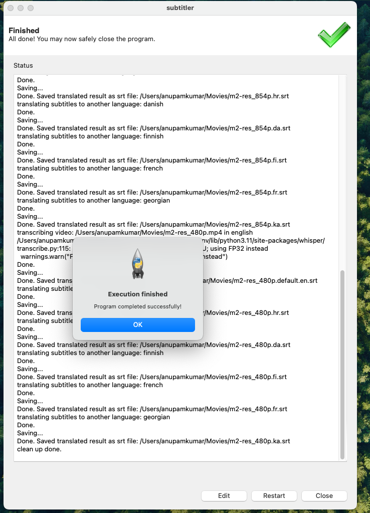

* clicking on `edit` button takes you back to the configuration view
* clicking on `restart` restarts the job (useful, incase you stopped the job and want to restart it)
* clicking on `close` exits the utility

### Using the CLI

```
usage: Subtitler [-h] (--video_files VIDEO_FILES | --video_dir VIDEO_DIR) --video_language
                 {af,am,ar...}
                 [--force_language_autodetect]
                 [--translation_languages [{af,am,ar...}]
                 [--translation_service {google,deepl,yandex,libre-translate,microsoft,chatgpt}]
                 [--translation_service_api_key TRANSLATION_SERVICE_API_KEY]
                 mode

Transcribe and Translate subtitles for videos in any language.

positional arguments:
  mode                  enter mode as cli to run cli. not entering a mode will attempt to run the gui

options:
  -h, --help            show this help message and exit
  --video_files VIDEO_FILES
                        full path to the video file you want to generate subtitles for
  --video_dir VIDEO_DIR
                        full path to directory where your video files may be

Transcription Configuration:
  --video_language {af,am,ar...}
                        Provide the language of the video(s). Set it to 'unknown' if you don't know and want AI to guess the
                        language.(WARNING! This may be a bad-idea because the AI may make a mistake with language detection)
  --force_language_autodetect
                        force language detection for all videos even if you provide 'video language' parameter

Translation Configuration:
  --translation_languages [{af,am,ar ...}]
                        select all the languages you want to also translate the subtitles to.
  --translation_service {google,deepl,yandex,libre-translate,microsoft,chatgpt}
                        pick a translation service. google is the default.
  --translation_service_api_key TRANSLATION_SERVICE_API_KEY
                        not required for Google. But required for all other services.
```

Basic usage is to transcribe a dir or a bunch of files. It can be done as shown below.

```
python subtitler.py cli --video_file "~/test_clips/test.mp4" --video_language=english
```

You can pass a bunch of `--translation_languages` seperated by space as follows

```
python subtitler.py cli --video_file "~/test_clips/test.mp4" --video_language=english --translation_languages urdu french german
```

The job execution log is identical to the GUI log. Here's a sample exerpt ...

```
python subtitler.py cli --video_file "/Users/anupamkumar/coding/subtitler_util/test_clips/test.mp4" --video_language=english --translation_languages urdu french german
Run Configuration: Namespace(mode='cli', video_files=['/Users/anupamkumar/coding/subtitler_util/test_clips/test.mp4'], video_dir=None, video_language='english', force_language_autodetect=False, translation_languages=['urdu', 'french', 'german'], translation_service='google', translation_service_api_key=None)

generated wav file for /Users/anupamkumar/coding/subtitler_util/test_clips/test.mp4 in /var/folders/sc/dtkl043110jc1jrjygz9jn2c0000gn/T/subtitler
loading whisper's 'large-v3' model
Done.
transcribing video: /Users/anupamkumar/coding/subtitler_util/test_clips/test.mp4 in english
/Users/anupamkumar/coding/subtitler_util/src/subtitler_util/.env/lib/python3.11/site-packages/whisper/transcribe.py:115: UserWarning: FP16 is not supported on CPU; using FP32 instead
  warnings.warn("FP16 is not supported on CPU; using FP32 instead")
Done.
Saving...
Done. Saved transcribed result as srt file: /Users/anupamkumar/coding/subtitler_util/test_clips/test.default.en.srt
translating subtitles to another language: urdu
Done.
Saving...
Done. Saved translated result as srt file: /Users/anupamkumar/coding/subtitler_util/test_clips/test.ur.srt
translating subtitles to another language: french
Done.
Saving...
Done. Saved translated result as srt file: /Users/anupamkumar/coding/subtitler_util/test_clips/test.fr.srt
translating subtitles to another language: german
Done.
Saving...
Done. Saved translated result as srt file: /Users/anupamkumar/coding/subtitler_util/test_clips/test.de.srt
clean up done.
```

## FAQ

#### Is is fast ?

This is as fast whisper library. The whisper library should preferably by run on GPU or NPU for accelerated performance, however it can run, albiet slowly on CPU as well.
I am looking into enhancing it's performance by using whisper.cc instead of python implementation of whisper.

The translation-services are fairly speedy. Your milage may wary depending on which service you use and your internet speed.

#### What translation-services are available ?

The following services are tested and available to use.

| translation-service | description | requires api-key |
| ----- | ----- | ----- |
| google | [google translate's API](https://cloud.google.com/translate/docs/reference/rest) | no |
| deepl | [deepl's translation API](https://www.deepl.com/en/translator) | yes |
| yandex | [yandex translate API](https://yandex.cloud/en/docs/translate) | yes |
| libre-translate | [libre translate's API](https://libretranslate.com/) | yes |
| microsoft | [microsoft azure conginitive services translation API](https://learn.microsoft.com/en-us/azure/ai-services/translator/reference/v3-0-translate) | yes |
| chatgpt | [translation using openAI's chatgpt-API](https://platform.openai.com/api-keys) | yes |

#### What languages are supported ?

* For transcription languages supported - [see here](https://platform.openai.com/docs/guides/speech-to-text/supported-languages)
* For translation languages supported - goto the specific translation service API documentation (links to each service documentation is provided above)

#### What's with the subtitle file formatting ?

It adhere's to the external-file-style guide prescribed by [jellyfin](https://jellyfin.org/docs/general/server/media/external-files/).

The orignally transcribed subtitle file will be saved as
`<media-file-name>.default.<media-file's-ISO-693-language-code>.srt`

All subsequent translated subtitle files will be saved as
`<media-file-name>.<media-file's-ISO-693-language-code>.srt`

> [!NOTE]
> The `.default` sub-extention is applied to the transcribed file indicating that the original media's default audio option. `.default` will be absent from all translated subtitle files.

#### Your examples all have warnings ... what's up with that ?

I am making this documentation on Apple M1 silicon. It does not have GPU acceleration and whisper's transcription is happening on the M1 chip. That's why you see the warning.

The utility is smart enough to first try to perform the ML-computation on GPU-device. If no GPU is found, it falls back to CPU, which is pretty slow TBH... :|

#### Will it run on my OS ?

Both the GUI and CLI should be able to run on any mainstream OS (Windows/Mac/GNU-Linux) without any problems.

> [!WARNING] 
> **A note on Windows 11 execution:**
> If you run into an error about numpy, like the one shown in the screenshot below, be aware that it's not an issue with this package. It's an issue with `pybind11` and `whisper` on Windows-11.
> 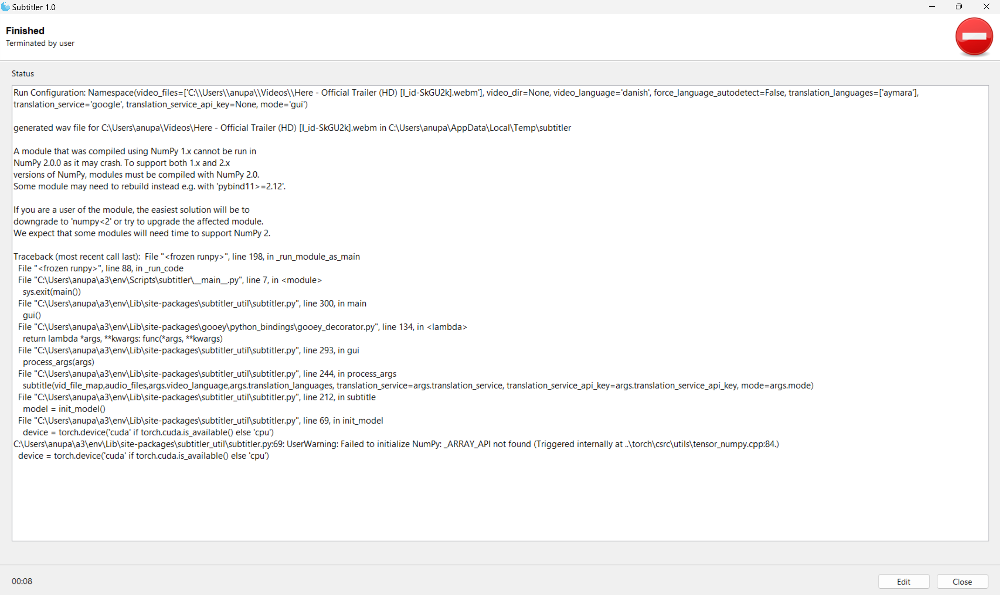


If you run into this problem, **The workaround to this problem is to remove numpy-2.0.0 or higher.**
```
pip uninstall numpy
```
and install the latest numpy-1.x
```
pip install numpy==1.26.4
```

## Standing on the shoulder of Giants : Credit where credit is due

Writing this tiny... tiny... tiny utility would not be possible if not for these projects. 💗

* [openai-whisper](https://github.com/openai/whisper) - The 'heart' the utility. Does the AI powered transcription. Where would this project be without it 😍
* [deep-translator](https://github.com/nidhaloff/deep-translator) - The library I use to do translations for transcribed subtitles. Super nice library. Provides a very nice, standardized interface for all translators services. 😄
* [Gooey](https://github.com/chriskiehl/Gooey) - For the GUI piece. My mind was blown when I first came across this! 🤯
* [ffmpeg-python](https://github.com/kkroening/ffmpeg-python) - For pulling media extraction and probing etc. An amazingly well-made library for all your complex ffmpeg needs 🤩
